# LaunchLab Mini for Beyblade X

**A removable launch-practice meter for Beyblade X string launchers.** LaunchLab Mini uses an optical sensor to measure the launcher's shaft speed, then shows your peak RPM, launch history, and a replay of the device's tilt and rotation on an M5StickS3 screen. Use it to compare pulls, track consistency across practice sessions, and try to repeat a chosen launch.

Built around **M5StickS3 K150**, with separate printed mounts for the **small analog QRE1113** or **older TCRT5000 / LM393** sensor. The current firmware supports both sensors through a saved Sensor profile setting; the old TCRT 0.2.0 build is preserved separately. The M5 keeps its factory case, display, controller and battery; you do not need a phone to view your results. The mount is designed to be removable. Check the supplied launcher interface and printed fit before using it on your launcher.

**[USB firmware updater](https://shadohead.github.io/launchlab-mini/) · [Recovery & M5Stack reinstall](docs/RECOVERY.md) · [Firmware & print releases](https://github.com/shadohead/launchlab-mini/releases) · [Parts list & Amazon links](#parts-list--build-your-own) · [Build & wiring](docs/BUILD.md)**

**Prototype validation:** **0.10.21** is the user-checked prototype revision. One firmware now serves both sensors through a saved **Sensor profile** setting (QRE / Standard with an 80-count mark floor, TCRT5000 with 60), with simpler A/B controls, a saved 180-degree display flip and clearer setting editors. The frozen application was installed with complete readback verification; NVS, bootloader, partitions and all 128 history records were preserved, and the user reports it working. The 80 MHz default, 240 MHz startup fallback and 50 kS/s optical rate are unchanged. Battery endurance, long-session reliability, absolute RPM/angle calibration, physical browser first install/rollback and stock recovery remain separate checks.

## Sidecar form factor

**Sidecar** is the LaunchLab form factor with the M5StickS3 mounted on its own carrier beside a separate optical sensor attachment. Sidecar supports either QRE1113 or TCRT5000; the name describes the mounting layout, not the sensor, firmware or hardware revision.

See the [Sidecar build guide](docs/BUILD.md) and [hardware downloads](docs/HARDWARE_VERSIONS.md#current-downloads).

## Parts list — build your own

Start with **one M5StickS3 K150 + one analog sensor + three short wires + printed mounts and M2 screws**. The StickS3 already contains the display, processor, IMU and battery. Choose **QRE1113** for the current firmware/UI, or **TCRT5000 / LM393** for the preserved old-sensor firmware.

**Amazon affiliate disclosure:** As an Amazon Associate I earn from qualifying purchases. Amazon links below use the [Beywatch](https://beywatch.gg/) affiliate tag and help support the project at no extra cost to you.

| Qty per build | Part | Which build / purchase notes | Buy |
| --- | --- | --- | --- |
| 1 | **M5StickS3 K150** | Both sensor builds. ESP32-S3, 8 MB flash/PSRAM, intact factory case. | [Amazon — M5Stack Official, ordered](https://www.amazon.com/dp/B0GWHN8HK3?tag=beywatchgg-20) · [M5Stack K150 specs](https://docs.m5stack.com/en/core/StickS3) |
| 1 | **SparkFun QRE1113 analog breakout, ROB-09453** | Small-sensor build; exact ordered listing. **Analog ROB-09453** is required. Use the SparkFun link if Amazon is unavailable. | [Amazon — SparkFun analog board](https://www.amazon.com/dp/B07YM4551X?tag=beywatchgg-20) · [SparkFun](https://www.sparkfun.com/sparkfun-line-sensor-breakout-qre1113-analog.html) |
| 1, instead of QRE | **TCRT5000 / LM393 module with AO** | Old-sensor build. Choose the four-pin **VCC/GND/D0/A0** module and use A0. The mount uses the measured 31×13×1 mm PCB; check your board/header dimensions. | [Amazon — HiLetgo 10-pack, ordered](https://www.amazon.com/dp/B00LZV1V10?tag=beywatchgg-20) |
| 3 leads | **Short 2.54 mm jumper wires** | VCC, GND and AO/OUT; the ordered SinLoon pack is 8 cm male-to-female. Trim/reroute as needed, checking connector clearance. | [Amazon — SinLoon 8 cm](https://www.amazon.com/dp/B08M3QLL3Q?tag=beywatchgg-20) · [Amazon — ELEGOO mixed jumper kit](https://www.amazon.com/dp/B01EV70C78?tag=beywatchgg-20) |
| 1 | **USB-C data cable** | Flashing and charging; use an existing cable that carries data. | Use an existing data cable, or [Amazon search — USB-C data cable](https://www.amazon.com/s?k=USB-C+data+cable&tag=beywatchgg-20) |
| 1 set | **Printed M5 + sensor mounts** | QRE: six-piece v0.40 plate. TCRT: six v0.43 sensor pieces + a separate M5 carrier. v0.68 M5 with wire channel and shortened hook is the preferred separate carrier. | [Print files](docs/HARDWARE_VERSIONS.md#current-downloads) |
| See below | **M2 machine screws** | Head style and length depend on the mount revision. | [Amazon — ordered MEIYYJ countersunk assortment](https://www.amazon.com/dp/B07HC3LQYS?tag=beywatchgg-20); pan-head sizes below |
| Small amount | **1.75 mm PLA filament** | Print yourself or use a printing service; saved profiles target P1S / 0.4 mm nozzle. | Use existing PLA, a printing service, or [Amazon search — PLA filament](https://www.amazon.com/s?k=1.75mm+PLA+filament&tag=beywatchgg-20) |

Links marked **ordered**, plus the SparkFun, SinLoon, ELEGOO and uxcell links, match the project-related product listings from purchase history. Cable, filament and pan-head links marked **Amazon search** are general supplies, not exact ordered products. Check the selected variant and pack contents; purchasing a component does not establish printed fit.

### Screws, connectors and tools

The ordered MEIYYJ assortment includes M2×4/5/6/8 **flat/countersunk heads**. Its M2×5 pieces can supply the clip/crossbar screws, subject to head-seat fit. Obtain the **pan-head** pieces separately: [Amazon search — M2×4 pan-head](https://www.amazon.com/s?k=M2x4+pan+head+machine+screws&tag=beywatchgg-20) · [Amazon search — M2×6 pan-head](https://www.amazon.com/s?k=M2x6+pan+head+machine+screws&tag=beywatchgg-20).

| Assembly | Screws required |
| --- | --- |
| Original v0.40 M5 carrier | 2 × **M2×6 pan-head**, from below into the StickS3 mounts. |
| QRE v0.40 plate sensor assembly | 2 × **M2×5 countersunk** for the latch crossbar + 2 × **M2×4 pan-head** for the sensor pressure plate. |
| TCRT v0.43 sensor assembly | 2 × **M2×5 countersunk** for the separate clip caps + 2 × **M2×4 pan-head** for the sensor keeper; M5 fasteners are additional. |
| Preferred v0.68 M5 carrier | 2 × M2 screws; M2×6 is the nominal reference. **Actual length, insert engagement and seating remain unverified.** |

If your sensor has bare pads, add a **3-pin 2.54 mm header** or solder the three wires directly. The ordered [uxcell right-angle male header strip](https://www.amazon.com/dp/B01461DQ6S?tag=beywatchgg-20) can be cut to three pins; check header direction and cable clearance against the printed seat. You will also need a small screwdriver, cutters, and a soldering iron/solder if attaching bare wires or headers.

Use a **Beyblade X string launcher with the supplied removable clip/port interface**. The interface derives from Migbello's BP Gear Port Connector; check retention and optical access on your actual launcher before a pull. No universal launcher-fit claim is made by these CAD files.

Wire **AO/OUT → G1 / GPIO1**, **VCC → 3V3 / 3V3_L2**, **GND → GND**. DO is unused. The Grove red lead supplies 5 V; use the Hat 3.3 V pin for these builds. [QRE build/wiring](docs/BUILD.md) · [TCRT build/wiring](docs/TCRT5000.md) · [Sensor and hardware versions](docs/HARDWARE_VERSIONS.md).

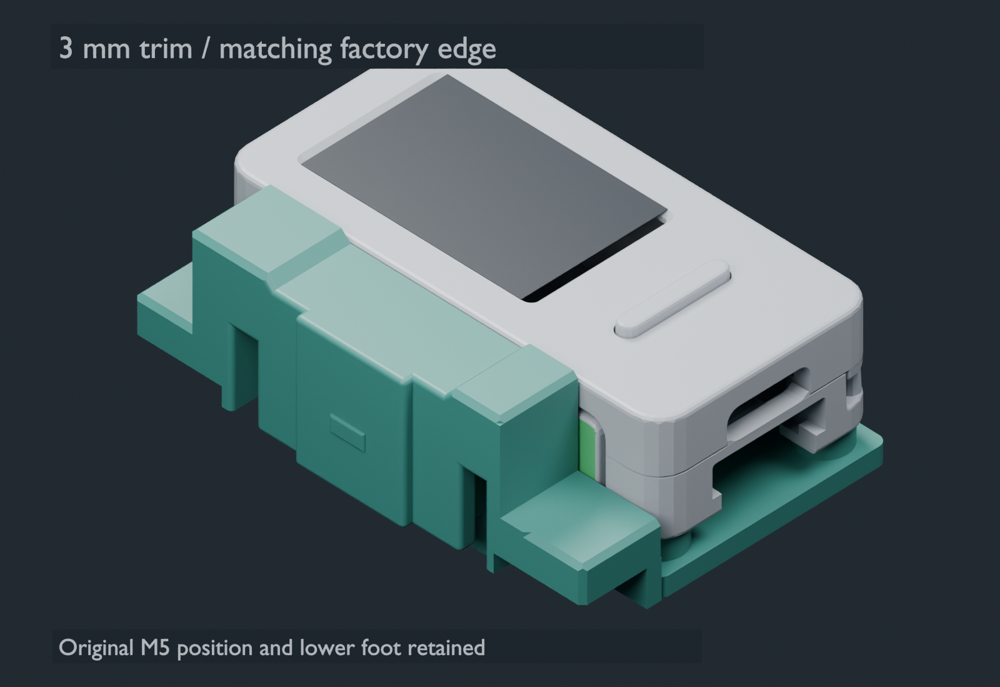


The updater defaults to **0.10.21**. It checks the complete known installed application before an app-only update, blocks downgrades and unknown/incomplete images, and skips writing an identical version. **Repair / rollback** requires an explicit target/backup confirmation; both app-only paths require the matching partition layout and boot selection. All modes check the detected ESP32-S3 chip and 8 MB flash capacity. The previous 0.10.14, 0.10.11, 0.10.7 and 0.10.1 binaries are preserved. Physical browser transfer, four-image installation of this revision, stock recovery and rollback remain unverified. [Update details](docs/UPDATER.md) · [Recovery and vendor reinstall](docs/RECOVERY.md).

Current firmware: **0.10.21** (QRE1113 or TCRT5000 via Sensor profile). Old TCRT firmware: **0.2.0**. Preferred separate M5 carrier: **v0.68**; latest TCRT mount: **v0.43**. The original QRE **v0.40** complete plate is still available. Firmware, M5 carrier and sensor-mount versions are independent.

**[Choose your sensor and see every revision](docs/HARDWARE_VERSIONS.md)** — includes the preferred v0.68 M5 carrier, earlier v0.41–v0.50 models, historical v0.19 TCRT, and current QRE files.

## What it does

The current revision is **0.10.21**, running at 80 MHz with unchanged 50 kS/s optical sampling. A saved Sensor profile selects QRE / Standard (80-count mark floor) or TCRT5000 (60-count floor). Controls are simpler: A opens or applies, B advances, hold B goes back or cancels. A saved 180-degree display flip and previewed brightness live in Settings. IMU startup recovery, prompt recaps, power diagnostics, tournament mode and USB keep-awake are retained; battery savings remain unmeasured. The old TCRT 0.2.0 release is an earlier RPM acquisition build with its own detector thresholds.

| Feature | What you see or do |
| --- | --- |
| Optical peak RPM | Three-turn elapsed-time average peak by default; validated single-turn peak is selectable in Settings. Three consistent turns confirm the pull before a peak is recorded. |
| Live level | Use the bubble and tilt angle while holding still to check the device's orientation before launching. |
| Launch recap | After a pull, see peak RPM, a clearer Start-to-End rotation replay, and frozen Start/End tilt circles. Press A to recall the latest recap. |
| Launch history | Review recent pulls and the current session's pull count, average, and best RPM. Retains up to 128 launches and 24 sessions on the device. |
| Pull and session trends | Compare individual pulls, a trailing five-pull average, and session averages to follow your practice consistency. |
| Tournament mode | Hold A on main to enter or exit; B cycles Recording Only/RPM. |
| Battery and auto-off | Check percentage, voltage and charging status. Shake-to-wake sleep after a configurable 1–10 minutes (3-minute default) without activity; a detected USB computer keeps it awake. |
| Browser firmware updates | Install over USB in desktop Chrome or Edge. Updates write only the application after checking the partition layout. |

RPM is **launcher-shaft speed**, not a direct measurement of the Beyblade's release RPM or its spin in the stadium. Motion replay shows rotation and gravity-relative tilt; it does not measure travel distance or absolute compass heading. The live level references the screen plane until the mounting orientation is calibrated.

## Device UI

These are saved device-framebuffer screenshots, not concept UI. Screens marked **DEMO** use synthetic sample data. The live/recap images are from firmware 0.6.2, and are historical examples; 0.10.1 has a revised tilt recap; history/trend images are from the 0.3.0 baseline and battery from 0.3.1. [Image provenance](docs/assets/ui/provenance.json) records their sources.

<table>
<tr><th>Live RPM & level</th><th>Launch recap</th><th>Launch history</th></tr>
<tr>
<td align="center">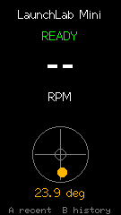</td>
<td align="center">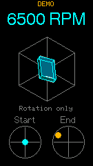</td>
<td align="center">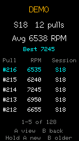</td>
</tr>
<tr><td>Ready state, held RPM result and level.</td><td>Recall the latest pull with A.</td><td>Browse pulls and session summaries.</td></tr>
</table>

<table>
<tr><th>Pull trend</th><th>Session trend</th><th>Battery</th></tr>
<tr>
<td align="center">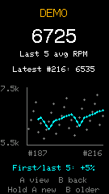</td>
<td align="center">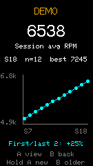</td>
<td align="center">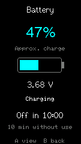</td>
</tr>
<tr><td>See variation across recent pulls.</td><td>Compare averages across sessions.</td><td>Check power before practice.</td></tr>
</table>

From the live screen, **A shows the last recap** and **B opens the menu** (History, New session, Battery, Settings, Tournament). In menus, A opens or applies, B moves to the next choice and hold B goes back one level or cancels an edit. Settings holds Sleep after, RPM method, Brightness, Flip display and Sensor profile; brightness and flip preview before you apply them. Hold A on main for one second to enter tournament mode (B cycles Recording Only/RPM; hold A exits). See the [firmware guide](firmware/LaunchLabMini/README.md).

## Exploded assemblies

The **Sidecar form factor** has **two independent assemblies**: the M5 display mount and your chosen optical sensor attachment (QRE1113 or TCRT5000). The views below use the exact published CAD meshes, separated for illustration. They do not assert a measured combined mounting position on a complete launcher. Electronics and screws are reference envelopes, not printed parts.

### Preferred M5StickS3 carrier — v0.68

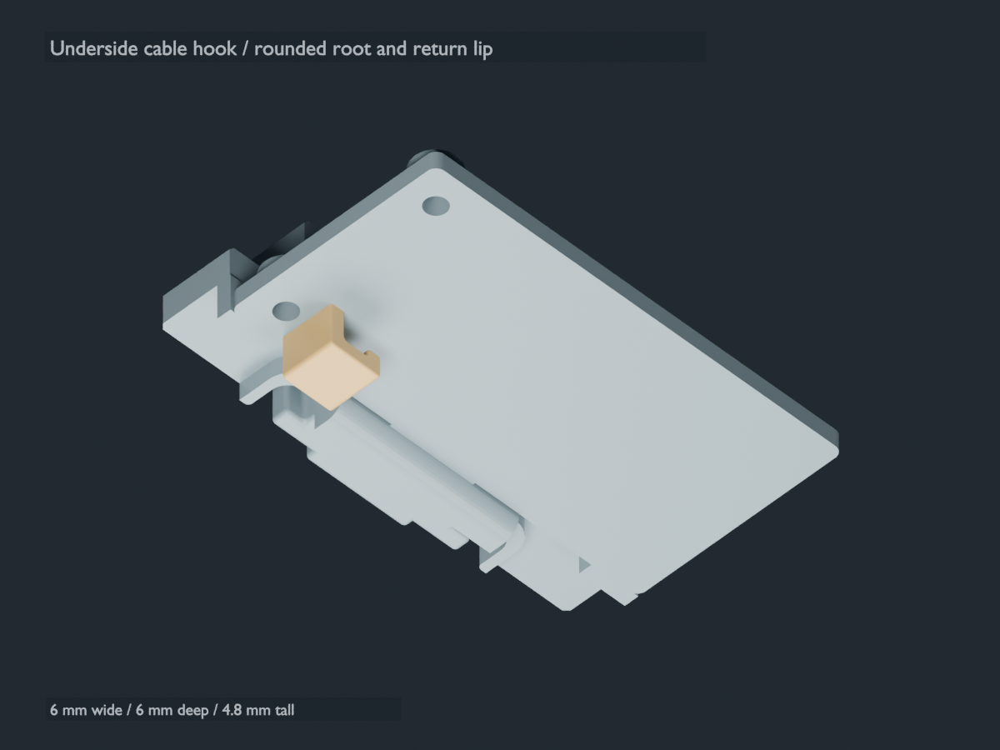

One replacement carrier retains the two older support humps and adds the side-open
wire channel plus a **6 mm long, 4.8 mm tall underside hook**, opening downward in
the bottom-face preview. The hook is 2 mm shorter than v0.66. The sensor mount
remains separate. [P1S PLA 3MF](hardware/M5_cable_hook_v068/bambu/LaunchLab_v068_P1S_PLA_M5_ATTACHMENT_PROTOTYPE.3mf)
· [Complete package](hardware/M5_cable_hook_v068_package.zip)
· [STL, editable CAD and rebuild source](hardware/M5_cable_hook_v068/README.md).
Saved slice: **43m33s / 8.38 g PLA**. Physical seating, screw engagement, hook
strength and cable retention remain unverified. Stagger the three leads inside
the smaller hook and keep plug housings outside its opening.

### Earlier M5StickS3 carrier — v0.50

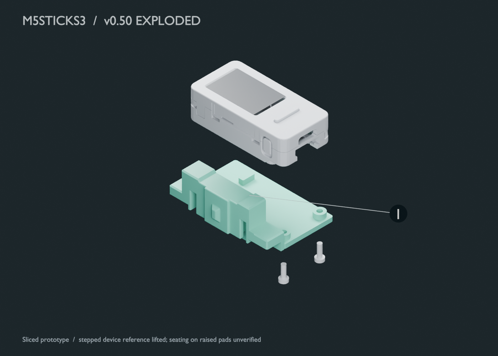

**1 — Earlier equal-height M5 carrier:** one replacement printed piece with the v0.49 soft center ramp, recessed screw heads and supports raised to 2.3 mm. [Download v0.50 3MF](hardware/M5_equal_supports_v050/bambu/LaunchLab_v050_P1S_PLA_M5_EQUAL_SUPPORTS_TREE_SLIM.3mf) · [Full package](hardware/M5_equal_supports_v050_package.zip). Saved slice: 43m18s / 9.24 g PLA.

**Prototype: physical seating and leveling are unverified.** The original nominal M5 reference overlaps the taller pads in its saved assembly pose; it is lifted here for illustration. Screw length and insert engagement must be checked after the counterbore revision. STEP files contain only the added supports; the full carrier is mesh geometry.

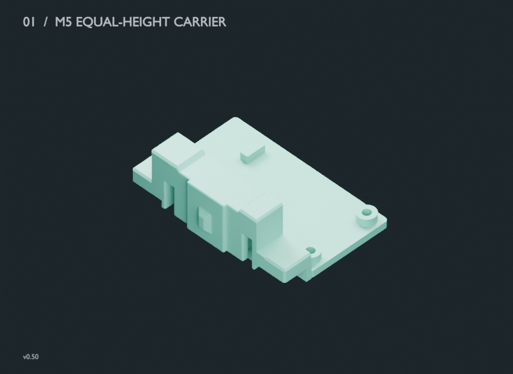

### Earlier M5StickS3 display mount — v0.40

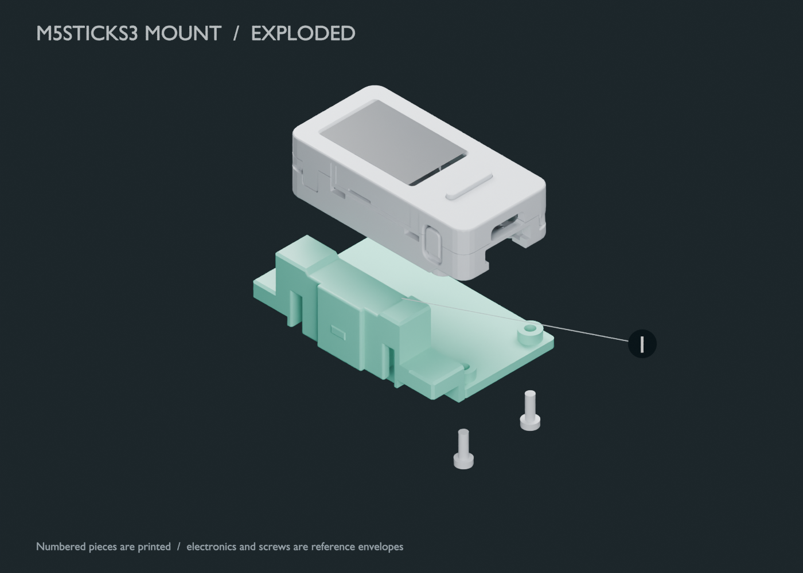

**1 — M5 platform:** supports the intact M5StickS3. Two M2×6 screws install from underneath into the device's existing mounts. The factory device, screen and soft-liner references are lifted for visibility in this view.

### Small QRE1113 sensor attachment

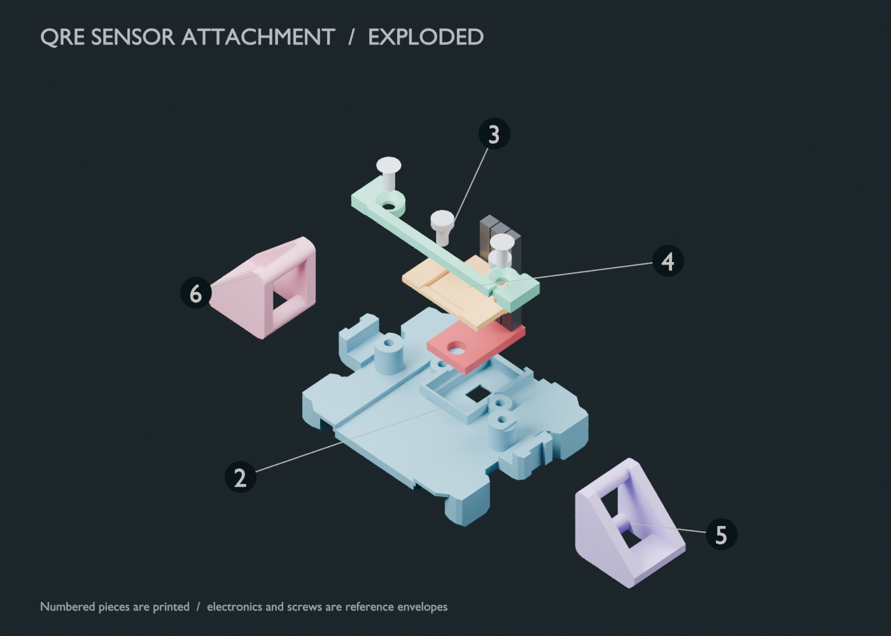

| No. | Printed piece | Purpose | Fasteners |
| --- | --- | --- | --- |
| 2 | QRE sensor base | Locates the small analog board and retains the launcher-facing interface. | Receives the crossbar and pressure-plate screws. |
| 3 | Latch crossbar | Retains the launcher latch assembly. | 2 × M2×5 countersunk. |
| 4 | Sensor pressure plate | Holds the QRE board against its seat. | 2 × M2×4 pan-head. |
| 5 | Left launcher latch | One side of the removable launcher attachment. | Retained by the base/crossbar assembly. |
| 6 | Right launcher latch | Opposite side of the removable launcher attachment. | Retained by the base/crossbar assembly. |

### Old TCRT5000 sensor attachment — v0.43

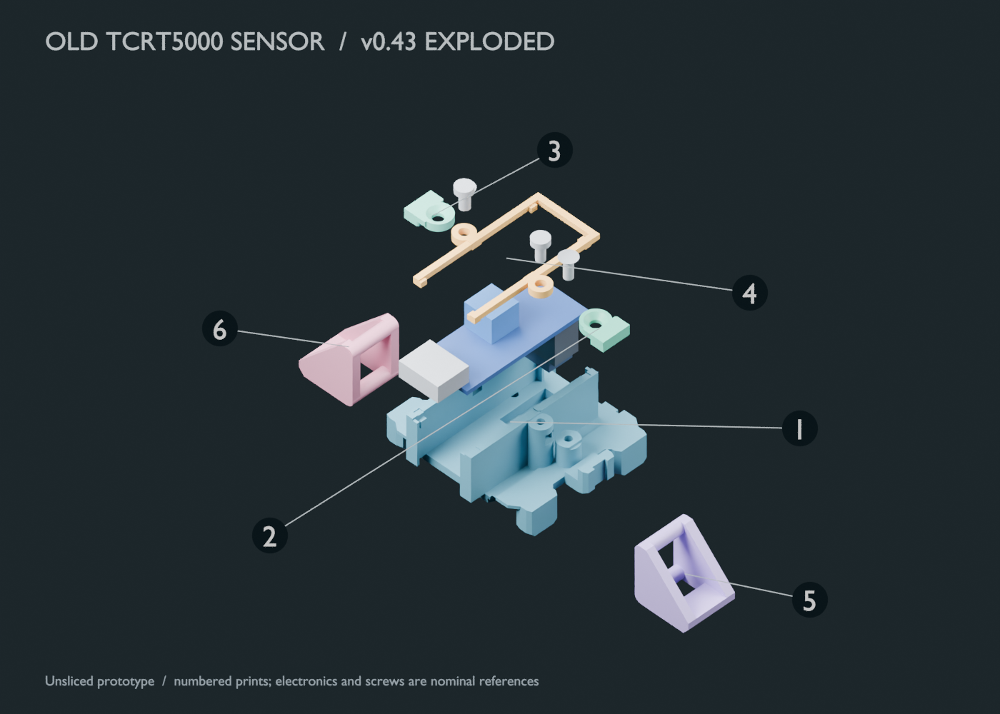

This version uses the **older 31×13×1 mm TCRT5000 / LM393 PCB**. Two independent screw-on clip caps replace the earlier crossbar; M5 stays on a separate carrier. [Six-piece CAD/STL/STEP package](hardware/minimal_TCRT_split_keepers_v043_package.zip) · [Old-sensor wiring & firmware](docs/TCRT5000.md). This is an **unsliced CAD prototype**; fit, solder clearance, preload and optical alignment still need checking.

| No. | Printed piece | Purpose |
| --- | --- | --- |
| 1 | TCRT sensor cradle | Locates the larger board and preserves the launcher interface. |
| 2 | Left clip cap | Retains one launcher latch with an M2×5 countersunk screw. |
| 3 | Right clip cap | Retains the opposite latch with an M2×5 countersunk screw. |
| 4 | Sensor pressure keeper | Holds the board with two M2×4 pan-head screws. |
| 5 | Left launcher latch | Removable launcher attachment. |
| 6 | Right launcher latch | Opposite side of the launcher attachment. |

<table>
<tr><th>1 · TCRT cradle</th><th>2 · Left cap</th><th>3 · Right cap</th></tr>
<tr><td>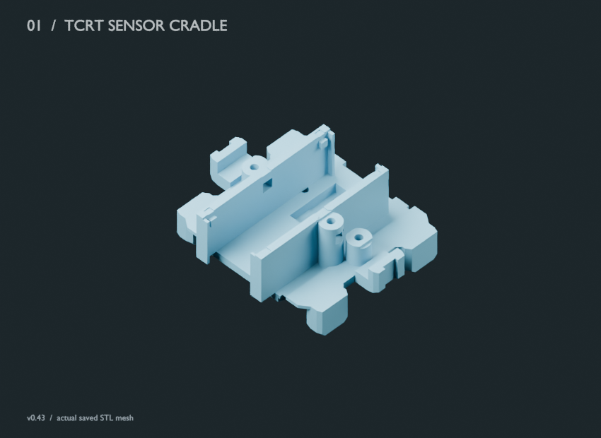</td><td>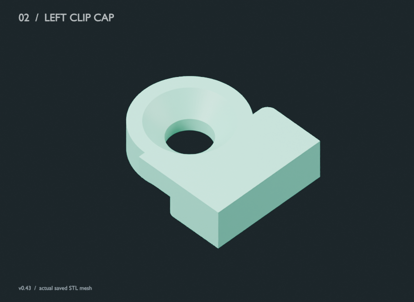</td><td></td></tr>
<tr><th>4 · Pressure keeper</th><th>5 · Left latch</th><th>6 · Right latch</th></tr>
<tr><td>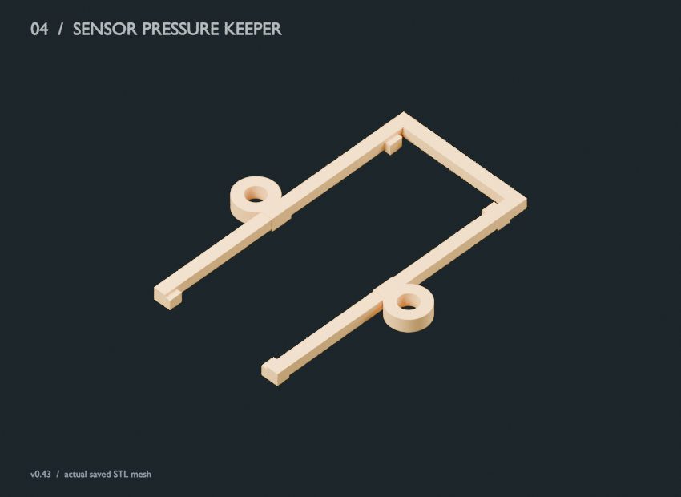</td><td>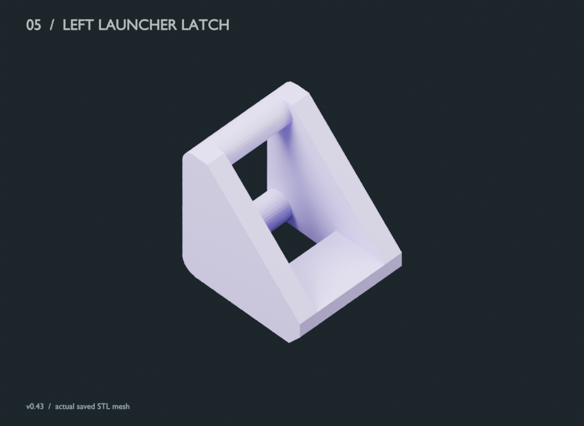</td><td>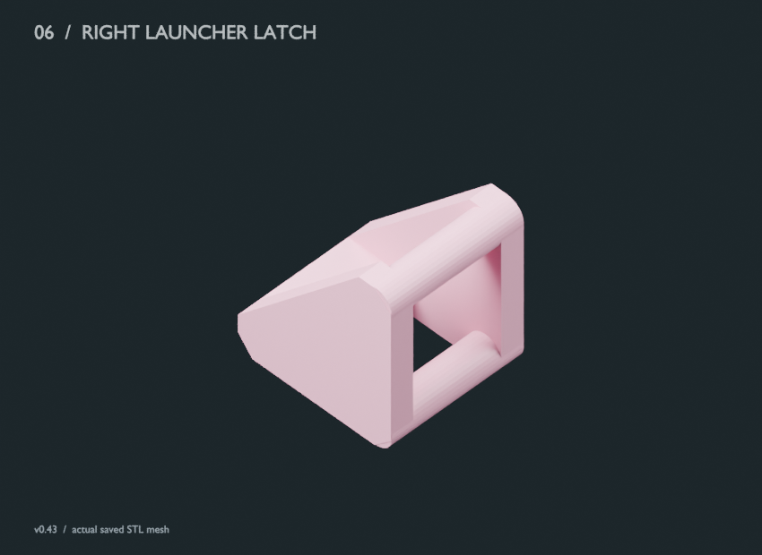</td></tr>
</table>

### Each original QRE printed piece — v0.40 plate

All six pieces are included in the complete v0.40 plate. The views below show their actual mesh geometry; each build uses one of each.

<table>
<tr><th>1 · M5 platform</th><th>2 · QRE sensor base</th><th>3 · Latch crossbar</th></tr>
<tr>
<td>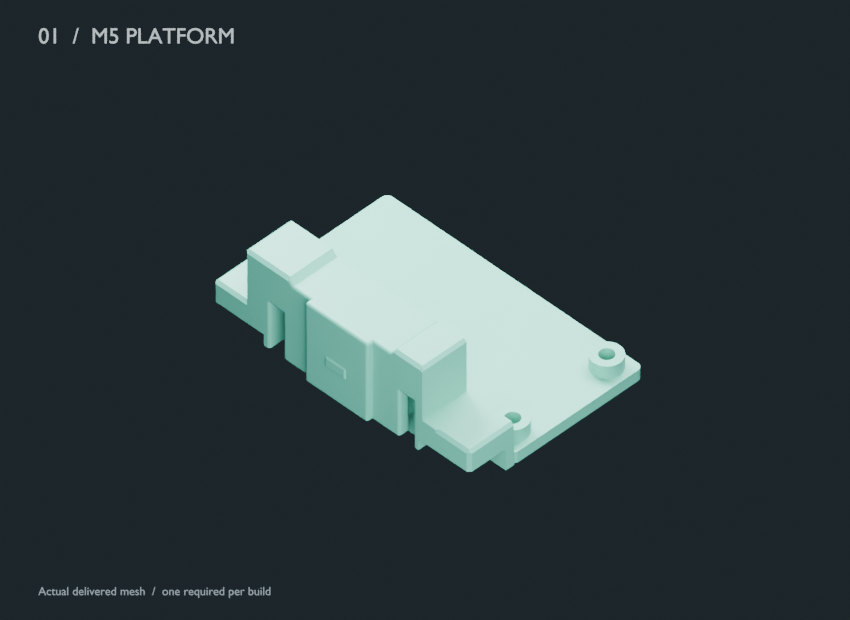</td>
<td>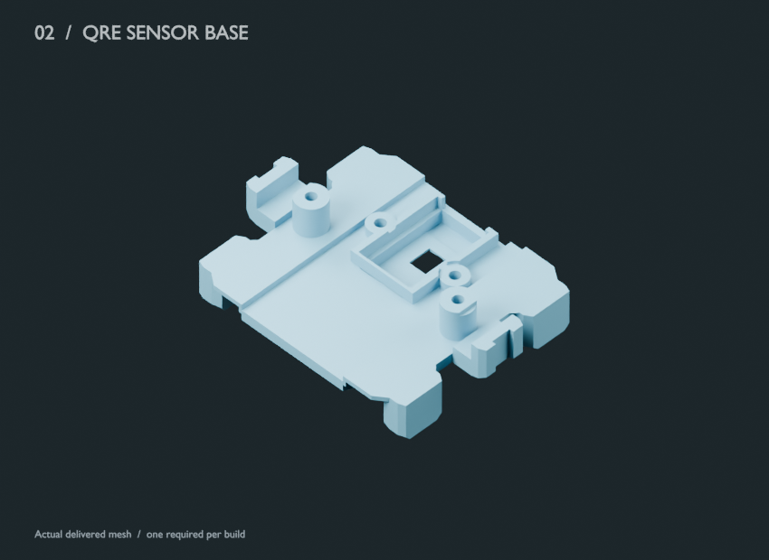</td>
<td>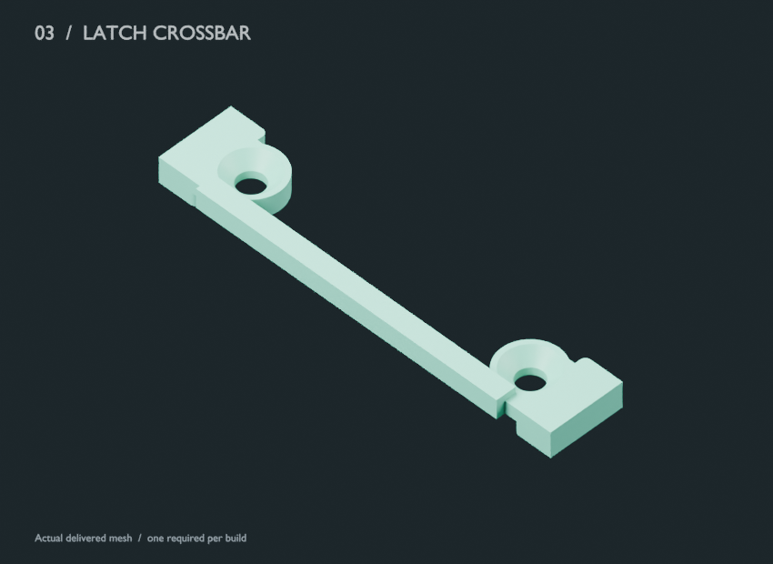</td>
</tr>
<tr><th>4 · Pressure plate</th><th>5 · Left launcher latch</th><th>6 · Right launcher latch</th></tr>
<tr>
<td>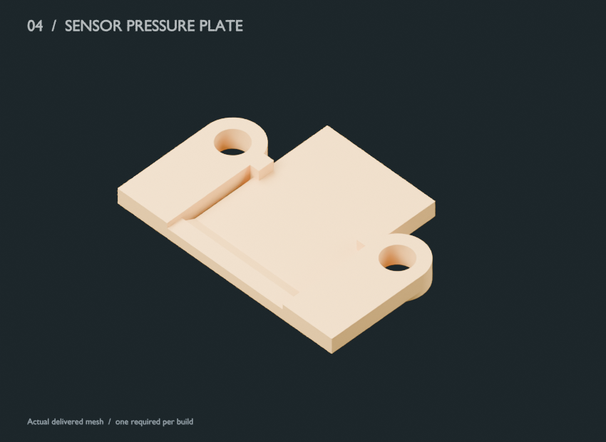</td>
<td></td>
<td></td>
</tr>
</table>

If your five-piece sensor attachment is already built, only the **v0.40 M5 platform** needs replacement. [Download the combined 3MF](hardware/LaunchLab_v040_ALL_ITEMS_PRINT/bambu/LaunchLab_v040_P1S_PLA_ALL_ITEMS_ONE_PLATE.3mf) or the [full print package](hardware/LaunchLab_v040_ALL_ITEMS_PRINT_package.zip). Physical fit, button/thumb access and launch-load retention still need checking after printing. [Render provenance](docs/assets/hardware/provenance.json) identifies the source meshes; `scripts/render-readme-hardware.py` reproduces these illustrations in Blender.

[Latest-render provenance](docs/assets/hardware/variants/provenance.json) records the frozen source mesh hashes; `scripts/render-variant-hardware.py` reproduces the new illustrations. [Version history](docs/HARDWARE_VERSIONS.md) explains v0.68 and every earlier v0.41–v0.50 change.

## Get started

Choose **QRE1113 or old TCRT5000** in the [version guide](docs/HARDWARE_VERSIONS.md) first. For TCRT use [its build/restore guide](docs/TCRT5000.md); the following complete-plate/updater steps are for QRE.

1. Download the [complete v0.40 print package](hardware/LaunchLab_v040_ALL_ITEMS_PRINT_package.zip) or open [the combined 3MF](hardware/LaunchLab_v040_ALL_ITEMS_PRINT/bambu/LaunchLab_v040_P1S_PLA_ALL_ITEMS_ONE_PLATE.3mf) in Bambu Studio.
2. Assemble with an intact M5StickS3 K150 and analog QRE1113. Read [BUILD.md](docs/BUILD.md) for wiring, fasteners and print settings.
3. Open the [updater](https://shadohead.github.io/launchlab-mini/) in desktop Chrome or Edge, choose Update or First install, connect USB with the M5 powered on, and select the device. The updater attempts download mode automatically; follow its manual reset steps if connection fails.

Update writes only the application at `0x10000` after checking the installed partition table. First install replaces the factory firmware and partition table and requires an explicit checkbox. Neither flow erases all flash. Every downloaded image is SHA-256 checked and writes use esptool's device MD5 verification. Chip identity alone cannot distinguish every ESP32-S3 board, so confirm your device is specifically an M5StickS3 K150.

## Hardware files

- [All hardware revisions and sensor compatibility](docs/HARDWARE_VERSIONS.md), with a [checksum inventory](hardware/versions.json).
- [Preferred v0.68 M5 carrier](hardware/M5_cable_hook_v068/): side-open wire channel, two support humps and shortened underside cable hook; CAD, source and saved P1S PLA slice.
- [Earlier v0.50 M5 carrier](hardware/M5_equal_supports_v050/): preserved sliced prototype, plus v0.44–v0.49 history.
- [v0.43 TCRT mount](hardware/minimal_TCRT_split_keepers_v043/): latest unsliced six-piece prototype, plus v0.19/v0.41/v0.42 history.

- [v0.40 complete plate](hardware/LaunchLab_v040_ALL_ITEMS_PRINT/): all six prints, source STLs, QRE STEP files, profiles and digital verification.
- [v0.40 M5 mount](hardware/LaunchLab_v040_right_block_print/): editable Blender mesh and GLB, independent 3MF, dimensions and CAD reports.
- [v0.33 QRE base](hardware/LaunchLab_v033_flush_QRE/): editable Blender and STEP assembly for the current sensor seat. Other sensor parts are frozen in the complete package.

The CAD includes original launcher attachment geometry derived from Migbello's BP Gear Port Connector. Preserve its attribution and share-alike notice when distributing changes.

## Develop

Install Arduino CLI, then run `bash scripts/build-firmware.sh`. It installs the pinned ESP32 3.3.0, M5Unified 0.2.23 and M5GFX 0.2.30 dependencies into a project-local cache and compiles the 8 MB flash / OPI PSRAM target. Source builds may differ byte-for-byte from the archived binary across hosts/toolchains. The published binary is the exact saved release, with recorded checksum.

Run `bash scripts/test-firmware.sh` for 20 native C++ suites with address/undefined sanitizers and six production harnesses. Website development requires Node 24+:

```sh
cd site
npm ci
npm test
npm run dev
npm run build
```

`python3 scripts/verify-artifacts.py` verifies published checksums and 3MF ZIP integrity. GitHub Actions runs the native tests, updater tests and artifact checks before deploying Pages from `main`.

19 frozen M5 firmware versions are in [firmware/releases](firmware/releases/catalog.json), including the working 0.3.0 QRE baseline and the separate 0.2.0 old TCRT5000 variant. Only current QRE firmware is offered by the web updater. Historical source snapshots retain their original layouts and notes; use each release's source rather than mixing headers across versions. Device backups, personal practice exports and factory flash dumps are excluded.

## Validation scope

The current firmware passed native tests and 13 saved optical waveform replays, and was installed with a verified flash hash. A prior QRE baseline was reported to work well in live use. Fresh physical acceptance of the single-turn peak algorithm, independent absolute RPM calibration, and printed v0.40 fit/strength remain pending. Browser flashing is covered by mocked-loader tests and browser UI checks; a physical browser-flash trial is still required.

RPM measures launcher-shaft revolutions, not direct Beyblade release RPM. Tilt replay has no measured travel distance or compass heading. Digital CAD/slicing checks establish file consistency, not printed fit or safe launch-load retention.

Software: MIT with upstream component licenses. Hardware: preserved Creative Commons Attribution Share Alike notices. See [LICENSE](LICENSE) and [THIRD_PARTY_NOTICES.md](THIRD_PARTY_NOTICES.md).
