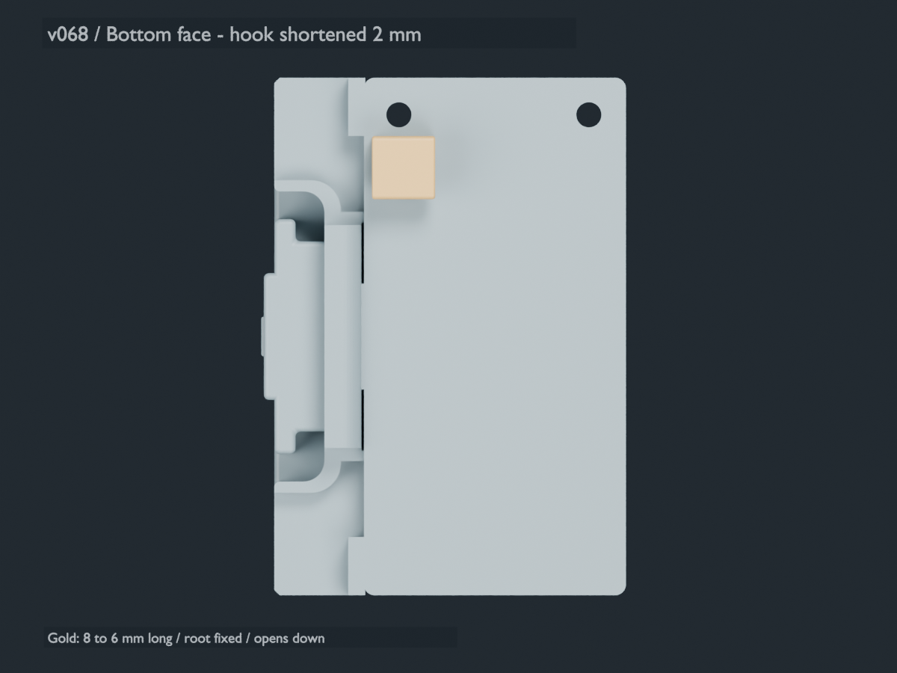

# Preferred separate M5StickS3 carrier — v0.68

This is the preferred separate carrier, selected by the project owner. It combines
the side-open wire channel, two older rounded support humps and the shortened
underside cable hook. It is a replacement M5 carrier only; reuse your sensor mount.
The stacked M5-over-sensor prototype is a different assembly.

The hook is 6 mm long in the bottom-view preview, shortened 2 mm from v0.66 with
its root fixed. It is 6 mm wide, projects 4.8 mm below the plate, has 1.6 mm walls,
and opens toward image-down in that view. The nominal mouth gap is 2.2 mm; the
inside cavity is 2.8 × 3.2 mm. Three nominal 1.3 mm insulated leads fit in a
staggered two-row arrangement, loaded separately. Keep DuPont housings outside
the hook. Actual wire diameters and printed retention require a dry fit.

## Print and assemble

- [Sliced P1S PLA project](bambu/LaunchLab_v068_P1S_PLA_M5_ATTACHMENT_PROTOTYPE.3mf)
- [Print-oriented complete carrier STL](stl/01_M5_channel_two_humps_cable_hook.stl)
- [Editable Blender model](LaunchLab_v068_M5_underside_cable_hook.blend)
- [Complete download package](../M5_cable_hook_v068_package.zip)
- [Standalone rebuild instructions](source/REBUILD.md)

Print one carrier using the saved -90° Y pose with the wire groove open upward.
Retain the WIRE GROOVE SUPPORT BLOCKER and Tree Slim supports. The saved P1S /
0.4 mm nozzle / PLA slice uses 0.2 mm layers and four walls, estimating **43m33s /
8.38 g** including supports. Re-slice and select the filament for your printer.
After cooling, remove accessible supports and inspect the hook mouth and groove.

With the M5 removed, lay all three leads into the side groove. It is 34 mm long,
3 mm high and at least 6.25 mm deep, with 1.5 mm retained walls. Connector housings
stay outside the groove ends. The hook provides a separate cable-management point.
Choose the shorter plug-in harness after a dry fit with relaxed bends.

The carrier retains two underside screw seats and a nominal pair of M2×6 screw
references. Confirm actual screw length and engagement in the factory M5 inserts.
Dry-fit the device on the two support humps; do not force it onto the pads or
tighten screws against rocking.

## Validation and limits

The complete carrier is one watertight mesh. CAD checks confirm retained prior
carrier material, nominal staggered-wire clearance and a clear wire groove.
The saved 3MF matches the manufacturing STL and its G-code checksum passes.
All 173 model layers have deposition, both support humps and the hook are present,
and no deposition enters the checked hook-opening or groove interior cores.
These are digital checks; physical seating, screw engagement, hook strength,
cable retention and launcher clearance remain unverified. No v0.68 print was sent.

The older nominal M5 underside overlaps the retained 2.3 mm support pads, as in
v0.65. Selection as the preferred design does not establish physical acceptance.
The factory M5 references are hidden in the primary Blender view for inspection.

The full carrier is mesh geometry. `step/CABLE_HOOK_ONLY.step` describes only the
analytic hook. `preview/` and `references/` are inspection geometry, not extra
parts to print. `source/carrier_before_hook.stl` preserves the exact v0.65 baseline;
`source/build.py` regenerates the hook union and print pose without private feedback.

Original BP Gear Port Connector: Migbello, Thingiverse 6856080. Attribution-Share
Alike notice, version unspecified, is preserved in [LICENSE.txt](LICENSE.txt).
